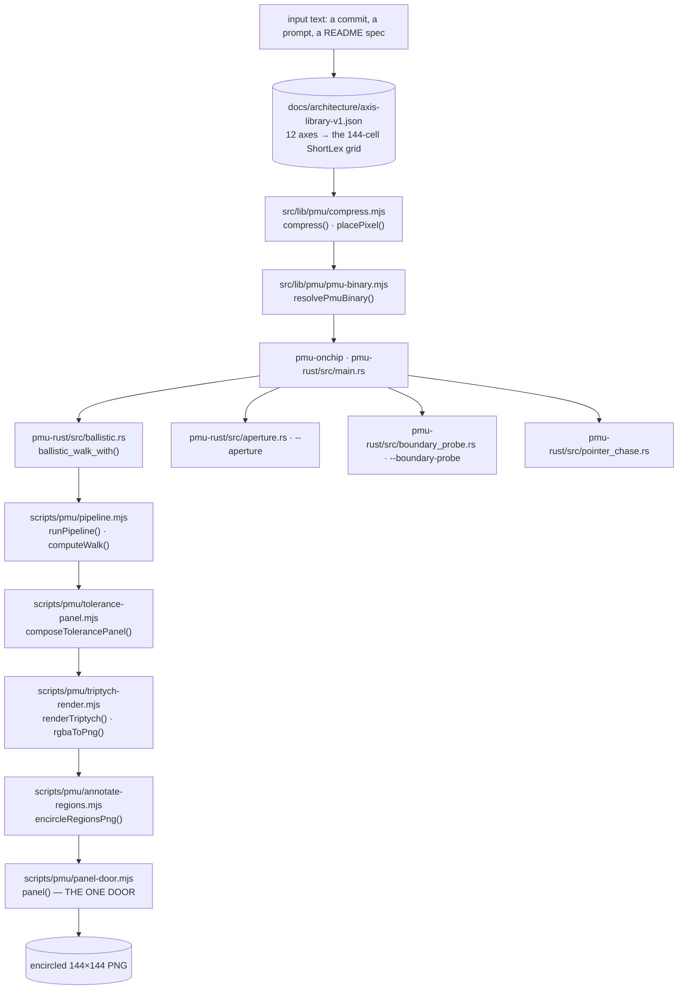
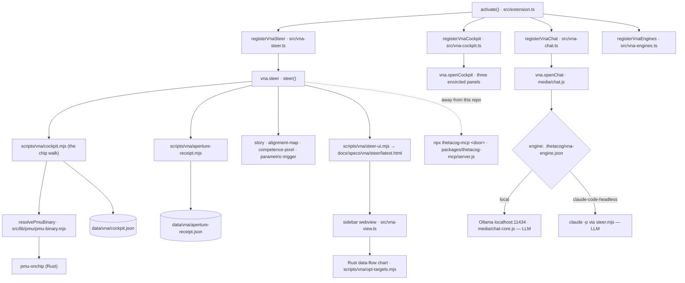
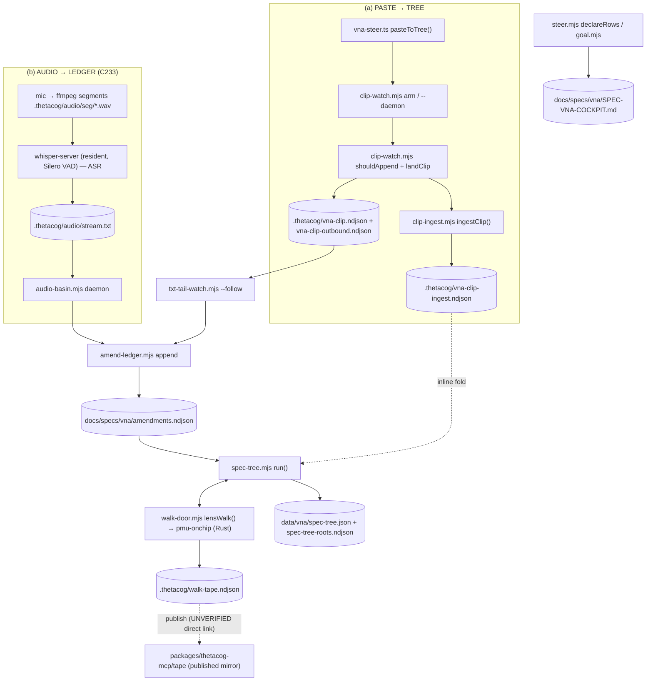
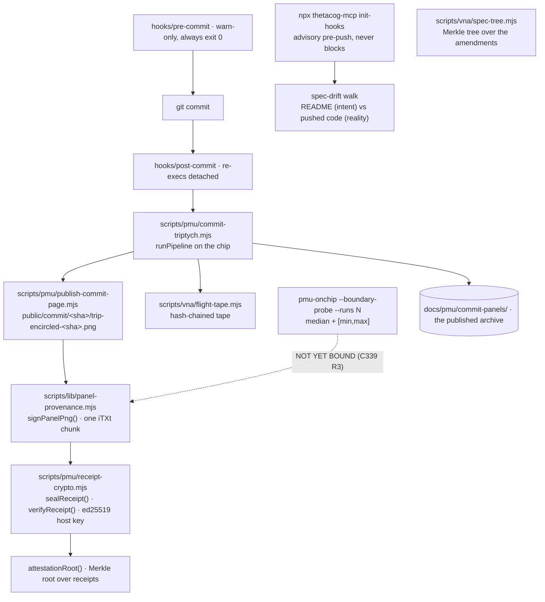

# DATA-FLOW — every file, the Rust walk, the NCD sensor, both ingest paths, where each part runs, and which parts are an LLM

This is the long form of the chart. The short form is generated into [the README](README.md#️-the-annotated-system-flow-chart--every-file-the-rust-walk-the-ncd-sensor-both-ingest-paths-where-each-part-runs-and-which-parts-are-an-llm) by `node scripts/vna/system-flowchart.mjs --readme`, and the same ten steps appear in the extension sidebar ([VS Code Marketplace: `thetadriven.thetacog-mcp`](https://marketplace.visualstudio.com/items?itemName=thetadriven.thetacog-mcp)).

**How to read it.** The chart draws the *ideal* configuration: how data should move in and out. Where the code does not match yet, the gap is drawn in and named with its spec row (C338, C339, …) rather than smoothed over. It gives you something to compare the code against, and one of the two will have to move.

**Every box answers three questions:** which file, LLM or NOT LLM, and whether it runs in Rust or Node. A box marked "port to Rust" is Node code that decides something or holds mass. Node is where a mechanism is proved; the Rust crate is where it lives.

**The one sentence the chart exists to make legible:** the receipt is LLM-free. Placement, panels, signatures and the spec tree have no model anywhere in their path. A model appears only where it narrates, rewrites prose or does work a commit then gates, and it never writes into a receipt. §5 lists every call site.

**What it is sufficient for, and what it is not.** It is sufficient for *where* work landed against a declaration written before it ran, re-runnable from the commit: same bytes, same hash. It is not sufficient for *whether* the work is right. That is undecidable (Rice, 1953), and nothing here claims it.

- [0 · The whole route, end to end — every way in, every door, Rust or not, every side case](#0--the-whole-route-end-to-end--every-way-in-every-door-rust-or-not-every-side-case)
- [1 · The core — the Rust ballistic walk and gzip-NCD](#1--the-core--the-rust-ballistic-walk-and-gzip-ncd)
- [2 · The VS Code extension](#2--the-vs-code-extension-marketplace-thetadriventhetacog-mcp)
- [3 · Ingest — the paste and the audio](#3--ingest--the-paste-and-the-audio)
- [4 · Receipts, signing, Merkle roots, and what is tested on hardware](#4--receipts-signing-merkle-roots-and-what-is-tested-on-hardware)
- [5 · The LLM boundary, what moves to Rust, and physics vs implementation](#5--the-llm-boundary-what-moves-to-rust-and-physics-vs-implementation)

Paths are relative to the source repository. The ones under `packages/thetacog-mcp/` ship in this package, and `scripts/`, `src/` and `pmu-rust/` are mirrored into it at publish time by `scripts/bundle-pmu.mjs`.

## 0 · The whole route, end to end — every way in, every door, Rust or not, every side case

The design intent is **one way of running it**: every trigger reaches the Rust walk through one door and leaves one receipt. This section draws what the code actually does today, so the gap between the two is visible rather than described. It was mapped on 2026-09-26 from three independent reads of the running code, each spot-checked on disk (one reader's claim, that `commit-triptych.mjs` runs twice per commit, was checked and is wrong: the paused branch of `hooks/post-commit` ends in `exit 0` at line 185).

**Colour key:** 🟧 Rust (`pmu-onchip`) · 🟦 Node / TypeScript · ⬜ bash · 🟥 LLM (only ever after the receipt) · ▭ cylinder = data written · dashed = a side case, a gap, or a path not running today.

```mermaid
flowchart TD
  subgraph IN["① INGRESS — eleven ways in, where the design wants one"]
    G1["git commit<br/>hooks/post-commit · detached"]
    G2["git push<br/>hooks/pre-push → spec-drift-check.mjs"]
    C1["Claude Code prompt, hook 1<br/>prompt-lens-hook.sh → prompt-lens.mjs"]
    C2["Claude Code prompt, hook 2<br/>steer-hook.mjs"]
    C3["Claude Code tool use<br/>steer-hook.mjs"]
    V1["VS Code command<br/>commands.ts door table"]
    N1["npx thetacog-mcp DOOR<br/>server.js, same door table"]
    M1["MCP tool<br/>pmu-inspect · pmu_verify"]
    P1["⌘C copy<br/>clip-watch.mjs, LaunchAgent"]
    A1["microphone<br/>audio-basin.mjs + whisper, ASR not LLM"]
    S1["Steer This File<br/>steer-file.mjs → txt-tail-watch.mjs"]
  end

  subgraph PC["post-commit TODAY: .thetacog/llm-pause exists since 2026-09-20, so every commit takes the paused branch"]
    PC1["commit-triptych.mjs"]
    PC2["tape-on-commit.mjs → tape-walk-worker.mjs"]
    PC3["record chain: attest · flight-tape · envelope ·<br/>cockpit.mjs → aperture-receipt.mjs"]
    PCX["unpaused branch only, NOT running today:<br/>pmu-measure-commit.mjs · lens-signal-emit.mjs"]
  end

  subgraph LED["spec ingest — lands text, walks nothing itself"]
    AL["amend-ledger.mjs → amendments.ndjson"]
    ST["spec-tree.mjs fold"]
  end

  subgraph DOORS["② NODE DOORS — three routes into Rust, plus a render door"]
    W["walk-door.mjs lensWalk()"]
    PL["pipeline.mjs runPipeline()<br/>Node still decides: invariants · σ · binarize · xor"]
    UD["unified-drift.mjs walkShape()"]
    PD["panel-door.mjs panel()<br/>→ tolerance-panel.mjs → runPipeline"]
  end

  subgraph BY["direct spawns — skip every door"]
    B1["prompt-lens.mjs --lattice"]
    B2["regions-chip.mjs · definer-walk-144.mjs"]
    B3["pmu-measure-commit.mjs"]
    B4["pmu-demo.mjs --throughput · verify-all.sh"]
    B5["~45 research scripts under scripts/pmu, scripts/vna"]
  end

  NO["compress.mjs placePixel()<br/>gzip-NCD placement in Node — never reaches Rust<br/>grip-lens · attest-demo · marketplace-match"]

  RES["pmu-binary.mjs resolvePmuBinary()"]

  subgraph RUST["③ RUST — pmu-onchip · one crate, two byte-identical copies"]
    R1["--lens · lens.rs<br/>NCD seed → definer walk → σ → fence"]
    R2["--sense · sense.rs"]
    R3["--project-xor"]
    R4["--walk · --ballistic · ballistic.rs"]
    R5["--aperture · aperture.rs"]
    R6["--lattice · --steer-plan · --boundary-probe · --throughput"]
  end

  subgraph OUT["④ OUTPUTS"]
    O1[("walk tape · signed rows, append-only")]
    O2[("lens receipts + the chat footer")]
    O3[("cockpit.json · aperture-receipt.json<br/>→ steer-ui.mjs → VS Code sidebar")]
    O4[("commit page + panel<br/>→ docs/pmu/commit-panels, the archive")]
    O5[("spec-tree.json + root log")]
    O6["email: canonical-send.sh · email-artifact.mjs"]
    O7["publish: bundle-pmu.mjs → npm · mirror-to-public.sh → GitHub"]
  end

  subgraph SIDE["side cases"]
    X1["binary missing → UNMEASURED, never a JS fallback"]
    X2["aperture NOT ADMISSIBLE → UNMEASURED"]
    X3["walk lock under load → deferred"]
    X4["heavy lock held → HALT, retried"]
    X5["120 s spawn kill · receipt-backfill.sh catches missed commits"]
    X6["LLM, after the receipt only:<br/>region-narrative.mjs qwen · chat · worker"]
  end

  G1 --> PC1 & PC2 & PC3
  G1 -.-> PCX
  G2 --> PL
  C1 --> W
  C1 -.-> B1
  C2 --> W
  C3 --> W
  V1 --> W & PD
  N1 --> W & PD
  M1 --> PL
  M1 -.-> B4
  P1 --> AL
  S1 --> AL
  A1 --> AL
  A1 --> W
  AL --> ST --> W
  PC1 --> PL
  PC1 -.-> B2
  PC2 --> UD
  PC3 --> PD --> PL
  PCX -.-> B3
  PCX -.-> UD

  W --> RES
  PL --> RES
  UD --> RES
  BY --> RES
  RES --> RUST
  RES -.-> X1
  R5 -.-> X2
  W -.-> X3

  W --> O1 & O2
  PD --> O3
  PL --> O4
  ST --> O5
  O4 --> O6 & O7
  O4 -.-> X6

  classDef rust fill:#f8d9bf,stroke:#b5541c,color:#3a1a05
  classDef node fill:#dbe7f7,stroke:#2f5d9e,color:#0d2240
  classDef bash fill:#ececec,stroke:#666,color:#222
  classDef llm fill:#fde2e2,stroke:#c0392b,color:#5a0d06,stroke-dasharray:4 3
  classDef gap fill:#fff,stroke:#c0392b,color:#5a0d06,stroke-dasharray:5 4
  class R1,R2,R3,R4,R5,R6 rust
  class C1,C2,C3,V1,N1,M1,P1,A1,S1,PC1,PC2,PC3,AL,ST,W,PL,UD,PD,RES,B1,B2,B4,B5,NO,O6,O7 node
  class G1,G2 bash
  class X6 llm
  class PCX,B3,X1,X2,X3,X4,X5 gap
```

<!-- e2e-map:mermaid -->

<!-- /e2e-map:mermaid -->

### The verdict: not one way yet

**Eleven ingresses.** Each one below names its trigger, its entry file and the route it takes into Rust.

1. **git commit** → `hooks/post-commit`, re-executed detached. Today it runs three walks per commit, none reading the others' result: `scripts/pmu/commit-triptych.mjs` through `runPipeline`; `scripts/pmu/tape-on-commit.mjs` → `scripts/pmu/tape-walk-worker.mjs` through `unified-drift.mjs`; and the record chain's `scripts/vna/cockpit.mjs` through `panel-door.mjs` → `runPipeline`. The unpaused branch would add `scripts/pmu/pmu-measure-commit.mjs` (a direct spawn) and `scripts/pmu/lens-signal-emit.mjs` (through `unified-drift.mjs`), but `.thetacog/llm-pause` has sent every commit down the paused branch since 2026-09-20.
2. **git push** → `hooks/pre-push` → `scripts/pmu/spec-drift-check.mjs` → `runPipeline`. The README (intent) walked against the pushed code (reality). Advisory; never blocks.
3. **Claude Code prompt, hook 1** → `scripts/cog/prompt-lens-hook.sh` → `scripts/pmu/prompt-lens.mjs` → `lensWalk`, plus one direct `--lattice` spawn for cell classification.
4. **Claude Code prompt, hook 2** → `scripts/vna/steer-hook.mjs` → `lensWalk`. **Same event as hook 1, same door, same tape: every prompt is walked twice.**
5. **Claude Code tool use** → the same `scripts/vna/steer-hook.mjs` → `lensWalk`, once per tool call (about 226 an hour, `data/vna/engine-map.json`).
6. **VS Code command** → `packages/thetacog-mcp-vscode/src/commands.ts` → `scripts/vna/steer.mjs` / `scripts/vna/steer-runner.mjs` → `lensWalk`, or `scripts/vna/cockpit.mjs` → `panel-door.mjs`.
7. **npx thetacog-mcp DOOR** → `packages/thetacog-mcp/server.js` → the same scripts as 6, including `scripts/pmu/walk.mjs` → `lensWalk`. A second transport for the same door table, used when the extension runs outside this repo.
8. **MCP tools** → `server.js` → `packages/thetacog-mcp/lib/pmu-inspect.js` → `runPipeline`; `pmu_verify` → `scripts/pmu/verify-all.sh`, which spawns the binary directly (verification, not placement).
9. **Copy** → `scripts/vna/clip-watch.mjs` (LaunchAgent) → `scripts/vna/amend-ledger.mjs` → `scripts/vna/spec-tree.mjs` → `lensWalk`.
10. **Microphone** → `scripts/vna/audio-basin.mjs` (ffmpeg + whisper, a transcriber, not an LLM) → `amend-ledger.mjs`, and also → `lensWalk` directly per transcribed part.
11. **Steer This File** → `scripts/vna/steer-file.mjs` → `scripts/vna/txt-tail-watch.mjs` → `amend-ledger.mjs` → the same fold.

The two `Stop` hooks (`scripts/cog/knock-on-stop-hook.sh`, `scripts/cog/lens-sidecar-stop-hook.sh`) read the tape and never spawn the binary, so they are not ingresses.

**Three routes into Rust, plus a render door.** `src/lib/pmu/walk-door.mjs` `lensWalk()` (one `--lens` call, the per-text walk), `scripts/pmu/pipeline.mjs` `runPipeline()` (`--sense`, `--project-xor`, `--walk` with Node deciding invariants, σ, binarize and the xor bookkeeping) and `src/lib/pmu/unified-drift.mjs` (the tape worker's and lens-signal's route). `scripts/pmu/panel-door.mjs` renders on top of `runPipeline`. All of them resolve the binary through `src/lib/pmu/pmu-binary.mjs`.

**Direct spawns that skip every door:** `prompt-lens.mjs --lattice`, `scripts/pmu/regions-chip.mjs`, `scripts/pmu/definer-walk-144.mjs`, `pmu-measure-commit.mjs`, `packages/thetacog-mcp/scripts/pmu-demo.mjs` (`--throughput`, a benchmark), `scripts/pmu/verify-all.sh`, and about 45 research and measurement scripts that call `resolvePmuBinary()` themselves.

**A placement path with no Rust in it:** `src/lib/pmu/compress.mjs` `placePixel()` places text by gzip-NCD in Node, for the grip lens, the attest demo and the marketplace match. It never calls `--sense`.

**Rust, exactly.** One crate, `packages/thetacog-mcp/pmu-rust/`, whose `src/` is byte-identical to the working copy the hooks run in `.thetacog/pmu/`. Binary `pmu-onchip`, dispatched in `packages/thetacog-mcp/pmu-rust/src/main.rs`. The placement flags: `--lens` (`lens.rs`), `--sense` (`sense.rs`), `--project-xor`, `--walk` and `--ballistic` (`ballistic.rs`), `--aperture` (`aperture.rs`). Around them: `--lattice` (`lattice.rs`), `--steer-plan` (`steer_plan.rs`), `--boundary-probe` (`boundary_probe.rs`), `--throughput`, and a set of read and maintenance flags. Four of the nine placement decisions run on the chip today; the other five are made in Node (`data/vna/engine-map.json`).

**Side cases, where each branches.** Binary missing: every caller reports UNMEASURED and none recomputes in JavaScript. Aperture below the gzip mass floor: NOT ADMISSIBLE, so UNMEASURED. Walk lock held under load: the walk is deferred, not queued forever. Heavy lock held (`scripts/vna/heavy-lock.mjs`): the job halts and is retried. Every spawn has a 120-second kill, and `scripts/controller/receipt-backfill.sh` re-renders any commit whose detached hook died. Language models appear only after the receipt: `scripts/pmu/region-narrative.mjs` (qwen narration of a finished panel), the chat, and the worker a spec row hands off to. Every box on the route from an ingress to a written receipt is NOT LLM; the receipt path is LLM-free.

### What "exactly one way" would take

Each of these is a gap between the map and the design. None of them is built yet.

1. **One walk per prompt.** Hooks 1 and 2 walk the same text through the same door and write two tape rows. One of them should read the other's row instead of walking again.
2. **One walk per commit.** The triptych, the tape worker and the cockpit each walk the same commit. One walk, with the other two reading its receipt.
3. **One route into Rust.** `runPipeline` and `unified-drift.mjs` should reach the binary through the same door as `lensWalk`, so there is one place a spawn happens and one tape.
4. **Every direct spawn either goes through the door or is labelled research.** Placement code that spawns the binary itself is a second definition of placement.
5. **`placePixel` moves to `--sense`**, so no placement is decided in Node.
6. **The five Node decisions move onto the chip** (punch-list rows n11–n15 in §5B).
7. **The tool-use hook stops walking on every tool call**, or proves it needs to.

## 1 · The core — the Rust ballistic walk and gzip-NCD

Every box in this section is **NOT LLM**. No model sits anywhere on the path from text to panel.

1. **IN.** A commit diff, a prompt or a README spec. `panel-door.mjs` accepts any of the three as `intent` or `reality`.
2. **AX** `packages/thetacog-mcp/docs/architecture/axis-library-v1.json`. Data, not code: 12 base axes whose ShortLex cross-product is the 144 anchors (`data/pmu/snippet-library-144.json`, loaded by `pipeline.mjs`).
3. **COMPRESS** `src/lib/pmu/compress.mjs` `compress()` / `placePixel()`. Takes a document and the anchor library; returns a cell, a σ and the witnesses. **gzip-NCD is the primary sensor** (`node:zlib`); simhash cosine is the second witness. JS. **It decides the placement, so it is a Rust-port candidate.**
4. **RESOLVE** `src/lib/pmu/pmu-binary.mjs` `resolvePmuBinary()`. The one resolver for the `pmu-onchip` path (honours `PMU_BINARY`). JS.
5. **BIN** `pmu-rust/src/main.rs`, binary `pmu-onchip`. Flags: `--walk`, `--ballistic`, `--aperture`, `--boundary-probe`, `--sense`, `--project-xor`, `--encode-png`. **Rust.**
6. **BALLISTIC** `pmu-rust/src/ballistic.rs` `ballistic_walk_with()`. A 20,736-cell grid plus a start point, walked row → column → row with depth decay and a time budget. Returns per-ply heat frames. **Rust.**
7. **APERTURE** `pmu-rust/src/aperture.rs`. Decides whether the corpus is large enough to be admissible (ratio band [0.25, 4]). **Rust.**
8. **PROBE** `pmu-rust/src/boundary_probe.rs`. Measures the packed-versus-crossing cache-line latency ratio, reported as a median with [min, max]. It prints NOT ADMISSIBLE when the control band (±15%) fails. **Rust. AXIOM 0 rung 3.**
9. **CHASE** `pmu-rust/src/pointer_chase.rs`. Dependent-load latency per cache tier, with no privileged counter. **Rust. AXIOM 0 rung 2.** It is a separate probe and is not run by the commit walk.
10. **PIPELINE** `scripts/pmu/pipeline.mjs`. Runs the stages resolve → invariants → sense → sigma → binarize → project → xor → walk. The walk stage spawns `pmu-onchip --walk` and stamps `engine: 'rust-ballistic-walk'` on the receipt. JS orchestration. **Port to Rust:** `data/vna/rust-punch-list.json` rows n11–n15 (admissibility, sigma, xor, binarize, invariants) are Node stages that still decide.
11. **TOL** `scripts/pmu/tolerance-panel.mjs`. Turns the walk output into the 144×144 tolerance classes: green in lane, amber bleed, red drift. JS.
12. **TRIP** `scripts/pmu/triptych-render.mjs`. Heatmap bytes to PNG, using only `node:zlib`. JS.
13. **ANNOT** `scripts/pmu/annotate-regions.mjs`. Finds the regions and burns the numbered rings into the pixels. JS.
14. **DOOR** `scripts/pmu/panel-door.mjs` `panel()`. The single canonical entry point, guarded by `tests/pmu/one-panel-door.test.mjs`. It returns `{png, meta, regions, stages, unmeasured}` and never fabricates: a failure comes back as `unmeasured`.
15. **OUT.** The encircled panel, delivered as a data URI or a CID-inline image.

**What ships in npm** (`packages/thetacog-mcp/package.json` `files`): `pmu-rust/` (the sources and the release binary), `scripts/`, `src/`, the axis library and the 144 / 20,736 snippet libraries. `scripts/bundle-pmu.mjs` copies the import closure of `commit-triptych.mjs` into the package at publish time.

## 2 · The VS Code extension (Marketplace: `thetadriven.thetacog-mcp`)

1. **activate()** `src/extension.ts`. Registers each module in its own try/catch, so one failure doesn't blank the rest. **NOT LLM**, pure wiring.
2. **vna.steer → steer()** `src/vna-steer.ts`. Runs the sensors in order and then renders the page. The header says so: "IT OWNS NO COMPUTATION … LLM-FREE." **NOT LLM.**
3. **cockpit.mjs.** Spawned through the door table in `src/commands.ts`. It walks the chip via `pmu-onchip` and writes `data/vna/cockpit.json`. **NOT LLM.**
4. **resolvePmuBinary** `src/lib/pmu/pmu-binary.mjs`. How the extension finds the binary: `PMU_BINARY`, then `.thetacog/pmu/target/release/pmu-onchip` under the repo or `$HOME`, then the named fallbacks. A 120 s kill guards each spawn. **NOT LLM.**
5. **aperture-receipt.mjs.** Reads `cockpit.json` (never re-walks) and writes S_in · F_in · κ · ω. **NOT LLM.**
6. **story / alignment-map / competence-pixel / parametric-trigger.** None of them imports a model client. **NOT LLM.**
7. **steer-ui.mjs → latest.html → src/vna-view.ts.** A read-only render: "IT COMPUTES NOTHING AND SPAWNS NOTHING." **NOT LLM.**
8. **The sidebar's Rust data-flow chart** `scripts/vna/opt-targets.mjs` (C336d). Ten steps (prompt → aperture → walk → panel → receipts → tape → spec tree → envelope → census → page), built from receipts that already exist. **NOT LLM.** This document is the long form of that chart.
9. **vna.openCockpit** `src/vna-cockpit.ts`. Reads the three encircled panels and the two receipts. **NOT LLM.**
10. **vna.openChat** `src/vna-chat.ts` + `media/chat.js` + `media/chat.css`. The UI shell; the host is a relay. **NOT LLM** itself.
11. **The local engine: LLM.** `media/chat-core.js` `streamChat` calls Ollama at `localhost:11434` (`gemma2:2b` for chat, `qwen2.5-coder:3b` for subagents, per `vna-engines.ts`). It writes chat turns to `.thetacog/chat/session.ndjson` and never writes a receipt.
12. **The headless engine: LLM.** The `claude-code-headless` preset (`vna-engines.ts`) runs `claude -p "{prompt}" --dangerously-skip-permissions --output-format json` through `steer.mjs`. **Know this before selecting it: that flag lets the agent run tools without asking.** Any preset or a custom template can replace it.
13. **.thetacog/vna-engine.json** (`scripts/vna/runner-resolver.mjs`) holds `{preset, customTemplate}` only. API keys live in VS Code SecretStorage, never in this file. **NOT LLM.**
14. **Away from this repo.** `doorCommand()` falls back to `npx thetacog-mcp <door>` (`packages/thetacog-mcp/server.js`), which dispatches the same door table and resolves the binary through the same `pmu-binary.mjs`, bundled by `scripts/bundle-pmu.mjs`. **NOT LLM.**
15. **The receipts the sidebar watches** are listed in `src/receipt-globs.ts` (`RECEIPT_GLOB`). The sidebar only reads them.

**The extension's LLM boundary:** there are exactly two model call sites, (11) and (12). Both sit behind the chat's send action and the engine you chose, and neither writes into a receipt, a placement or a panel.

## 3 · Ingest — the paste and the audio

- **P1** `packages/thetacog-mcp-vscode/src/vna-steer.ts` `pasteToTree()` (~L186). Clipboard or sidebar paste in; ordered calls to P2→P5 out. **NOT LLM.** TypeScript, dispatch only.
- **P2** `scripts/vna/clip-watch.mjs` `arm` / `--daemon`. Polls the OS clipboard every second. **NOT LLM** (its header: "a model in this path would paraphrase the amendment").
- **P3** `scripts/vna/clip-watch.mjs` `shouldAppend()` (a pure decision) + `landClip()`. Appends the clip verbatim, refusing secrets and our own exports. **NOT LLM.** JS.
- **P4** `.thetacog/vna-clip.ndjson` records one row per append or refusal. `.thetacog/vna-clip-outbound.ndjson` holds the shas of our own exports so they are never re-ingested. Both append-only.
- **P5** `scripts/vna/clip-ingest.mjs` `ingestClip()`. Takes pbpaste, a file or stdin, then calls the tail watcher, the amendment ledger and the spec-tree fold inline. **NOT LLM.**
- **P6** `.thetacog/vna-clip-ingest.ndjson`: one receipt per ingest.
- **A1** ffmpeg segmentation, as described in the `scripts/vna/audio-basin.mjs` header. The mic is permission-gated. **NOT LLM** (signal processing). The exact spawn line is UNVERIFIED.
- **A2** whisper-server (resident, Silero VAD), managed by `audio-basin.mjs`. **An ASR model, not an LLM.** The file says so: "whisper is a transcriber, not a judge — nothing here grades, places or decides with a model."
- **A3** `.thetacog/audio/stream.txt`: append-only `🎙️ HH:MM:SS <text>` lines.
- **A4** `scripts/vna/audio-basin.mjs`. Batches the stream into one ledger row (`via:'audio'`). Audio never touches the steer file (C233). **NOT LLM.**
- **T1/T2/T3** `scripts/vna/txt-tail-watch.mjs` → `scripts/vna/amend-ledger.mjs append` → `docs/specs/vna/amendments.ndjson`. Every ingest path converges on this one append-only ledger. **NOT LLM.**
- **L1/S1** `scripts/vna/steer.mjs` declares rows in `docs/specs/vna/SPEC-VNA-COCKPIT.md`. **NOT LLM** — rows are verbatim operator text.
- **M1** `scripts/vna/spec-tree.mjs` `run()`: typed nodes with a sha256 per node and one Merkle root. **NOT LLM** ("sha256, gzip, one Rust walk"). **Port to Rust:** `rust-punch-list.json` row n=4 "fold (spec-tree)", holds-mass (peak RSS ~2.7 GB, reads ~883 MB).
- **M2** `src/lib/pmu/walk-door.mjs` `lensWalk()` runs the `pmu-onchip` binary. **Rust. NOT LLM.** Returns a placement plus a tape row.
- **M3** `data/vna/spec-tree.json` + `data/vna/spec-tree-roots.ndjson`: the append-only root log.
- **W1** `.thetacog/walk-tape.ndjson` is the live tape (`PMU_WALK_TAPE` overrides the path).
- **W2** `packages/thetacog-mcp/tape/` is the published mirror, filled by `scripts/pmu/sync-tape-to-package.mjs` from `docs/pmu/commit-panels/`. It is downstream of ingest, not written by it.
- **Also port to Rust:** `rust-punch-list.json` row n=5 "transcript-rows", which reads the whole amendments ledger about 124 times an hour.

## 4 · Receipts, signing, Merkle roots, and what is tested on hardware

1. **hooks/pre-commit.** Every gate is warn-only, and the file ends `exit 0`. **NOT LLM.**
2. **hooks/post-commit.** Re-execs itself detached so the commit returns at once, then dispatches the render and the audits. The orchestration is **NOT LLM**; some dispatched *audits* call a model, and none of them writes into a receipt.
3. **scripts/pmu/commit-triptych.mjs.** `runPipeline` walks the commit on the chip binary to produce the intent / reality / delta panels. The walk is **NOT LLM**. The optional `narrateRegions` (qwen) **is an LLM**: it narrates afterwards, never feeds the panel, and is skipped by `--fast`.
4. **scripts/pmu/publish-commit-page.mjs.** Writes `public/commit/<sha>/` and the stable `trip-encircled-<sha>.png`. **NOT LLM.**
5. **scripts/lib/panel-provenance.mjs.** Inserts one `iTXt` chunk (`thetadriven:provenance`) before IEND and leaves IHDR/IDAT untouched, so `pixels_sha256` stays recomputable. The signed body carries the machine (CPU, arch, cache line / L1d / L2, OS), the walk binary's sha256, the engine the pipeline reported, and the tested / not-tested lists below. Check it with `node scripts/lib/panel-provenance.mjs verify <png>`. **NOT LLM.**
6. **scripts/pmu/receipt-crypto.mjs.** `sealReceipt` / `verifyReceipt` use a persistent ed25519 host key at `~/.thetacog/pmu/keys/host.priv.pem`. **The key is a 0600 file, not a key the chip holds.** `attestationRoot` is a Merkle root over sorted receipt hashes. **NOT LLM.**
7. **The advisory pre-push hook** (`npx thetacog-mcp init-hooks`). Walks the README against the pushed code, writes `.thetacog/prepush.log`, and never blocks. The halt is yours to wire. The walk is **NOT LLM**; on a rupture it writes an investigation *prompt* for you or your agent.
8. **scripts/vna/spec-tree.mjs.** A sha256 per node, one root per run, logged to `data/vna/spec-tree-roots.ndjson`. **NOT LLM.**
9. **scripts/vna/flight-tape.mjs.** The hash-chained tape. Historical rows are kept unsigned (`unsignedRows()`) rather than rewritten, because rewriting a record is the thing AXIOM 1 forbids. **NOT LLM.**
10. **The boundary probe.** Median plus spread, and NOT ADMISSIBLE on control failure. **NOT LLM.** Not yet bound into any receipt.
11. **The priced ledger** (`appendPricedRow`, README "What makes that true, mechanically"). One door: rotate, Merkle root over the archive plus current rows, re-sign in the same call. **NOT LLM.**
12. **docs/pmu/commit-panels/.** Every panel, published on purpose.

**Tested on the machine that signed it (placement only):**
- AXIOM 0 rung 1: positions are addresses. The pmu-onchip ballistic walk (binary sha256 in the signature) produced these pixels on the CPU named in the signature.
- Which binary walked, and on what platform.
- The signature itself, which anyone can re-verify.

**NOT hardware-tested:**
- Rung 2, dependent-load latency (`pointer_chase.rs`): a separate probe, not run by the commit walk and not bound into the panel.
- Rung 3, the boundary-crossing cost (`--boundary-probe`): measured, but not bound into any receipt yet (C339 R3).
- Rung 4, the raw MSR / perf-counter read: apparatus scope, never shipped by default.
- The key's custody: a file, not Secure Enclave / TPM. **So none of this is "hardware-attested".**
- The crossing count: not computed from the commit's own walk yet (C338).
- Whether the work is correct: undecidable (Rice). The panel is sufficient for WHERE the work landed, not WHETHER it is right.
- The tape: historical rows are unsigned, and new rows are signed only where a device key is present.

## 5 · The LLM boundary, what moves to Rust, and physics vs implementation

### A · Where a language model is called, and what it never touches

Every model call in the package and the extension:

- `packages/thetacog-mcp/scripts/rewrite/llm.mjs` does ghost-read rewriting of prose. `local()` calls Ollama (`qwen2.5:7b`) and `cloud()` calls `claude -p --model sonnet`. **LLM.** The output is rewrite candidates for a person to accept, and it never reaches a receipt.
- `packages/thetacog-mcp/scripts/cog/rule-grab.mjs`, opt-in `--qwen`. **LLM.** It extracts a quote from retrieved rule text, then `verifyExtraction` checks that quote lexically against the source. The label it produces ("grabbed" / "invented") is about a quote, not a placement. It still reads like a verdict, and it has no guard proving it stays out of receipts. That is listed under D.
- `packages/thetacog-mcp/scripts/tape/sonnet.mjs` `sonnetJson()` makes one bounded `claude -p` call with hooks forced off. It is used by `packages/thetacog-mcp/scripts/tape/propose-questions.mjs` and `packages/thetacog-mcp/scripts/tape/choose-meaningful.mjs`. **LLM.** It feeds spec-tree *authorship*, never the receipt.
- `packages/thetacog-mcp/scripts/tape/worker.mjs` and `packages/thetacog-mcp/scripts/tape/sharpen-rules.mjs` dispatch workers and propose rule text. **LLM.** What they produce is code and prose, which a commit gates.
- The extension's chat and subagents, covered in §2 items 11–12. **LLM.** They answer from state that has already been computed, and a subagent's edits are code, not placement.

The LLM-free paths, each with its guard:

- **Placement and the walk.** gzip-NCD plus the Rust `pmu-onchip` walk, recomputable from `git show <sha>:<file>`. Guard: `tests/pmu-simulator/receipt-is-llm-free.test.mjs`.
- **Panels.** The one door (§1); signed without a model (§4).
- **Receipts and roots.** `scripts/pmu/receipt-crypto.mjs`.
- **The spec tree.** Derived, never invented. Guard: `tests/tape/emit-spec-is-derived.test.mjs`.

### B · What should move to Rust (`data/vna/rust-punch-list.json`, `data/vna/engine-map.json`, `scripts/vna/engine-map.mjs`)

Node is where a mechanism is proved; the Rust crate is where it lives. Ranked by mass × call rate:

- **n1 hook:posttool-steer** (`scripts/vna/steer-hook.mjs`). ~226 calls/h and ~471 MB read per call. Port it to a streaming read.
- **n2 hook:prompt-steer** (same file, the prompt path). A 946 MB peak, the largest in the map.
- **n3 txt-tail-watch.** ~240 calls/h; cheap per call but constant.
- **n4 fold (spec-tree)** (`scripts/vna/fold-writer.mjs`). A 2.7 GB peak; it reads the ledger whole, twice. This is "the spec tree" mass CLAUDE.md names as the first thing to move.
- **n5 transcript-rows.** Reads the whole amendments ledger on every call.
- **n6 envelope** (`scripts/vna/envelope.mjs`). **n7 steer status. n8 grip-meter** (537 MB read per call).
- **n9–n10 flight-tape turn and prompt-lens-hook.** UNMEASURED; there is no baseline yet.
- **n11–n15, the decisions still made in Node:** admissibility, sigma, xor, binarize, invariants. Four of the nine placement decisions run on the chip today. Until these five move, "every decision on the chip" is not yet true. Each row's acceptance test: `pmu-onchip --<stage>` agrees byte-for-byte with the Node path on a real commit.

### C · What the physics predicts, beside what is built

- **k_E = 0.003, 0.3 bits per boundary crossing, as a defined unit.** *Built as a constant* (`K_E_CANONICAL` in `scripts/pmu/rc-compute.mjs`). The trust half-life is ln 2 / k_E ≈ 231 crossings. It is never a daily rate, and the guard `tests/voice/k-e-is-per-crossing-never-per-day.test.mjs` keeps it that way.
- **Every crossing counted on the receipt (C338).** *Partial.* `rc-compute.mjs` already counts crossings off a real `pmu-onchip --ballistic` sequence, but over a canonical grid, not the commit's own walk, and nothing prints the count on a receipt. The guard is not written yet.
- **The receipt names its hardware (C339).** *Partial.* Published panels carry the platform, the binary and the tested / not-tested lists (§4). The probe reading (R3) and the canonical-versus-shuffled timing prediction (R4) are not built. The guard is not written yet.
- **The canonical layout walks cheaper than a shuffled one (C339 R4).** *Not built.* `rc-compute.mjs --scatter` shows the crossing *count* rises when the layout is scattered, and `scripts/pmu/search-cost-vs-crossing.mjs` reads the per-crossing cost. Nothing yet times both layouts on one machine with the sign fixed in advance.
- **Retain, never overwrite (C341).** *Built* for the engine map: a hash-chained `data/vna/engine-map-history.ndjson`, guarded by `tests/vna/c341-it-s-quite-a-last-system.test.mjs`. Gap: `rust-punch-list.json` is still overwritten on each run.

### D · If the physics is right, what we can build next from here

1. **Chain the punch list** (`scripts/vna/engine-map.mjs`). Break it: two runs on one commit rank differently and no prior ranking is retained.
2. **Print the crossing count on the receipt (C338)** by wiring the count from `rc-compute.mjs`, taken from the commit's own walk, into `scripts/lib/panel-provenance.mjs`. Break it: two runs on one sha disagree.
3. **Bind the probe reading into the signature (C339 R3).** Break it: a panel claims rung 3 without a median, a spread and a control verdict inside the signed body.
4. **Time canonical against shuffled (C339 R4)** in `scripts/pmu/search-cost-vs-crossing.mjs`, reporting every run, sign flips included. Break it: the shuffled walk is not slower, or the gap does not grow with the extra crossings.
5. **Move the five Node decisions onto the chip** (punch-list n11–n15). Break it: any stage differs byte-for-byte from the Node path.
6. **Stream the prompt hook** (n2, `scripts/vna/steer-hook.mjs`). Break it: the Rust output is not byte-identical on the real record.
7. **Guard the `rule-grab.mjs` quote label** so it provably never reaches a receipt, or rename it away from verdict language. Break it: a receipt-adjacent artifact cites "grabbed" or "invented".
8. **A key the chip holds** (Secure Enclave / TPM) for the host signature. This is the only step that would make "hardware-attested" true. Until then the phrase is never used.

---

*Generated from five independent reads of the running code on 2026-09-27; each path was checked on disk. Guard: `tests/vna/c340-when-all-of-these-have-been.test.mjs`. It fails if a path named in a backtick here stops existing, if a section loses its LLM statement, if either README stops linking here, or if the chart ever merges our walker with the CPU's performance-monitoring hardware, or claims attestation by a chip-held key it does not have.*
